## 1. Group members and respective algorithms

1. Merge Sort: Asir Hussain
2. Radix Sort: Luke Gutierrez
3. Sample Sort: Muna Rahman

### 2. Brief project description, what architecture you are comparing your sorting algorithms on.


### 2a. Pseudocode for Merge Sort. 
Include MPI calls you will use to coordinate between processes.

```text
# Pseudocode for Merge Sort

Initialize the MPI environment
Get rank
Get num_processes

# Generate the full array
if rank == 0:
    Generate array

# Scatter the array evenly among processes
MPI_Scatter(full_array, local_array)

# Sort each data chunk locally
LocalSort(local_array)

# Begin merging phase
# At each stage, processes exchange data with a partner
# and keep either the smaller or larger half depending on their rank
step = 1
while step < num_processes:
    
    partner = rank XOR step

    # Exchange data sizes first to handle variable segment lengths
    Send local_size to partner
    Receive partner_size from partner

    # Allocate buffer to receive partner’s data
    partner_array = allocate(partner_size)

    # Exchange data arrays with partner
    MPI_Sendrecv(local_array, partner_array, partner, partner)

    # Merge both sorted arrays into a single sorted array
    merged_array = merge(local_array, partner_array)

    # Determine which half to keep
    if rank < partner:
        local_array = first_half(merged_array)
    else:
        local_array = second_half(merged_array)

    # Proceed to the next stage (partner distance doubles each time)
    step = step * 2

# Gather final sorted segments to root process
MPI_Gather(local_array, full_array)

# If rank 0, verify global array is sorted correctly
if rank == 0:
    Verify that full_array is sorted

# Finalize MPI
Finalize MPI

```

### 2b. Pseudocode for Radix Sort. 
Include MPI calls you will use to coordinate between processes.
  
  MPI_Init(&argc,&argv);

  RadixSort(local_array, int base, MPI_comm comm){
  
    int rank, world_size;
    MPI_Comm_rank(comm, &rank);
    MPI_Comm_size(comm, &world_size);
    
    # find the global max so we know how my digits to iterate through
    int local_max = max(local_array)
    int global_max = 0;
    MPI_Allreduce(&local_max, &global_max, 1, MPI_INT, MPI_MAX, comm);
    int digits = number of digits in global_max

    for digit in length of digits{

      // create a local histogram for this digit
      local_hist = histogram(local_array, digit, base)

      // combine local histograms into global histogram
      global_hist = MPI_Allreduce(local_hist, global_hist, base, MPI_INT, MPI_SUM, MPI_COMM_WORLD)

      // find the prefix sum of the global histogram
      bucket_start = prefix_sum(global_hist)

      // determine destinations of each number in local_array and the number of elements in local_array the process will send to rank p
      dest_ranks;
      send_counts = array of legth world_size
      compute_destinations(local_array, digit, bucket_start, comm.size)
      
      // determine how many elements will be received from each rank
      recv_counts = array of length world_size
      MPI_Alltoall(send_counts, 1, MPI_INT, recv_counts, 1, MPI_INT, comm)

      //allocate receive buffer
      recv_buf = array of size sum(recv_counts)

      // redistribute elements from global_array back to proccesses based on new destinations
      MPI_Alltoallv(send_buf, send_counts, MPI_INT, recv_buf, recv_counts, MPI_INT, comm)

      local_array = recvbuf
    }
    return local_array
  }


### 2c. Pseudocode for Sample Sort. 
Include MPI calls you will use to coordinate between processes.

```text
# Pseudocode for Sample Sort
int rank, world_size;
MPI_Comm_rank(comm, &rank);
MPI_Comm_size(comm, &world_size);

int oversample = 2;
int s = oversample * (world_size - 1);

# Local sort
local_sort(local_array);

# Regular samples from locally sorted data
samples_local = pick_regular_samples(local_array, s);

# Gather samples, choose splitters at root, broadcast
all_samples = buffer<int>(s * world_size);
MPI_Gather(samples_local, s, MPI_INT, all_samples, s, MPI_INT, /*root=*/0, comm);
if (rank == 0) {
  sort(all_samples.begin(), all_samples.end());
  pivots = choose_evenly_spaced(all_samples, world_size - 1); // (p-1) splitters
}
MPI_Bcast(pivots, world_size - 1, MPI_INT, /*root=*/0, comm);

# Partition local data into p buckets by splitters
buckets = partition_by_pivots(local_array, pivots, world_size);

# Alltoall counts
int send_counts[world_size], recv_counts[world_size];
for (int p = 0; p < world_size; ++p) send_counts[p] = size(buckets[p]);
MPI_Alltoall(send_counts, 1, MPI_INT, recv_counts, 1, MPI_INT, comm);

# Displacements + pack send buffer
int send_displs[world_size], recv_displs[world_size];
send_displs[0] = 0; for (int p = 1; p < world_size; ++p) send_displs[p] = send_displs[p-1] + send_counts[p-1];
recv_displs[0] = 0; for (int p = 1; p < world_size; ++p) recv_displs[p] = recv_displs[p-1] + recv_counts[p-1];

send_buf = concat_in_rank_order(buckets);
recv_buf = buffer<int>(recv_displs[world_size-1] + recv_counts[world_size-1]);

# Alltoallv data shuffle (each rank r receives bucket r)
MPI_Alltoallv(&send_buf[0], send_counts, send_displs, MPI_INT,
              &recv_buf[0], recv_counts, recv_displs, MPI_INT, comm);

# Final local sort of received bucket
local_array = recv_buf;
local_sort(local_array);

return local_array;
```

### 3. Evaluation plan - what and how will you measure and compare

  Data Types: We will test both integer and double data types to ensure perofrmance is generalized across numeric types

  Input Sizes: During development, we will test will smaller input (5, 10, 15, 20) to validate the functionality of
  each model. After validation, we will increase input sizes to the order of thousands to measure the scalability of
  our models.

  Input Types: Each model will be tested on four distinct input distributions:
    - Sorted
    - Sorted with 1% perturbed 
    - Random
    - Reverse sorted
  These distinct input distributions will compare the efficiency of each model under different cases (best case, worst case, etc.)

  Weak Scaling: We will measure how execution time changes as both the problem size and number of processors increase proportionally.
  Each process will handle a constant workload, allowing us to compare how well each algorithm maintains performance as total input size and processor count grow.

  Strong Scaling: We will fix the global input size N and increase the number of processors/nodes p. For each N in {2^20, 2^24, 2^28}, we will run with p in {1, 2, 4, 8, 16, 32, 64}, reusing the same seeded input instance across all p and scattering evenly. We will record the max rank time for "main" as Tp, compute speedup (T1/Tp) and efficiency (speedup/p), run 3 trials and report the median. We will also break out compute vs communication using Caliper (comp_large/small, comm_large/small).

- Data types (int, double)
- Input sizes
- Input types (Sorted, Sorted with 1% perturbed, Random, Reverse sorted)
- Strong scaling (same problem size, increase number of processors/nodes)
- Weak scaling (increase problem size, increase number of processors)

```

### **Calltrees for Each Algorithm**:

```
# MPI Merge Sort
0.792 MPI_Init
0.106 main
├─ 0.002 data_init_runtime
├─ 0.101 comm
│  ├─ 0.101 comm_large
│  │  ├─ 0.005 MPI_Bcast
│  │  ├─ 0.021 MPI_Scatter
│  │  └─ 0.075 MPI_Gatherv
│  └─ 0.000 comm_small
│     └─ 0.000 MPI_Gather
├─ 0.004 comp
│  ├─ 0.003 comp_large
│  └─ 0.003 comp_small
└─ 0.000 correctness_check

# MPI Sample Sort
0.208 main
├─ 0.045 data_init_runtime
│  └─ 0.045 comm
│     ├─ 0.032 comm_small
│     │  ├─ 0.032 MPI_Bcast
│     │  └─ 0.000 MPI_Scatter
│     └─ 0.012 comm_large
│        └─ 0.012 MPI_Scatterv
├─ 0.014 comp
│  ├─ 0.011 comp_large
│  └─ 0.004 comp_small
├─ 0.112 comm
│  ├─ 0.030 comm_small
│  │  ├─ 0.003 MPI_Gather
│  │  ├─ 0.015 MPI_Bcast
│  │  └─ 0.012 MPI_Alltoall
│  └─ 0.082 comm_large
│     ├─ 0.047 MPI_Gatherv
│     └─ 0.035 MPI_Alltoallv
└─ 0.032 correctness_check
   └─ 0.031 MPI_Allreduce

# MPI RadixSort 
1.101 main
├─ 0.837 MPI_Init
└─ 0.263 main
   ├─ 0.000 _data_init_runtime_
   ├─ 0.096 comm
   │  └─ 0.096 comm_large
   │     ├─ 0.096 MPI_Scatterv
   │     └─ 0.000 MPI_Gatherv
   ├─ 0.166 radix_sort
   │  ├─ 0.162 comm
   │  │  ├─ 0.159 comm_small
   │  │  │  └─ 0.159 MPI_Allreduce
   │  │  └─ 0.003 comm_large
   │  │     ├─ 0.000 MPI_Alltoall
   │  │     └─ 0.003 MPI_Alltoallv
   │  └─ 0.004 comp
   │     ├─ 0.003 comp_small
   │     │  └─ 0.002 comm
   │     │     └─ 0.002 comm_small
   │     │        └─ 0.001 MPI_Exscan
   │     └─ 0.001 comp_large
   └─ 0.000 correctness_check
```

### 5. Metadata collection

The following code was responsible for collecting metadata in our programs.

```
adiak::init(NULL);
adiak::launchdate();    // launch date of the job
adiak::libraries();     // Libraries used
adiak::cmdline();       // Command line used to launch the job
adiak::clustername();   // Name of the cluster
adiak::value("algorithm", algorithm); // The name of the algorithm you are using (e.g., "merge", "bitonic")
adiak::value("programming_model", programming_model); // e.g. "mpi"
adiak::value("data_type", data_type); // The datatype of input elements (e.g., double, int, float)
adiak::value("size_of_data_type", size_of_data_type); // sizeof(datatype) of input elements in bytes (e.g., 1, 2, 4)
adiak::value("input_size", input_size); // The number of elements in input dataset (1000)
adiak::value("input_type", input_type); // For sorting, this would be choices: ("Sorted", "ReverseSorted", "Random", "1_perc_perturbed")
adiak::value("num_procs", num_procs); // The number of processors (MPI ranks)
adiak::value("scalability", scalability); // The scalability of your algorithm. choices: ("strong", "weak")
adiak::value("group_num", group_number); // The number of your group (integer, e.g., 1, 10)
adiak::value("implementation_source", implementation_source); // Where you got the source code of your algorithm. choices: ("online", "ai", "handwritten").
```

They show up in the `Thicket.metadata` when the caliper file is read into Thicket.

## 6. Performance evaluation

### Strong Scaling Speedup:

<figure style="text-align:center;">
  
  <figcaption>Figure 1.1: Large Computation Speedup Plot</figcaption>
</figure>

- Radix Sort: From Figure 1.1, it can be seen that the speedup of the large computations for Radix Sort scales exponentially, as the number of processes exponentially increases. For all input types (Sorted, 1% Perturbed, Random, and Reverse sorted), the speedup follows closely to the ideal speedup, reaching a speedup of 512 at 1024 processes. The reason the ideal speedup is 512 and not 1024 at 1024 processes is beacuse the baseline for the graphs was chosen to be 2 processes, since this was the loweset number of processes tested. The results In Figure 1.1 are to be expected, as the large computations are collectively O(N) per digit pass. This means by distributing the input array (N) across multiple processes that perform independed computations, faster computation times are achieved. 

- Merge Sort: From Figure 1.1, it can be seen that the strong scaling speedup for Merge Sort in the comp_large region increases exponentially, as the number of processes exponentially increase, closely following the ideal speedup line across all input types (Sorted, 1% Perturbed, Random, and Reverse Sorted). This indicates that when the computation workload per process is large, Merge Sort efficiently utilizes the available resources with minimal communication overhead. The algorithm’s local sorting operations dominate performance in this region, resulting in excellent scaling efficiency up to 1024 processes. The close overlap of the input types also shows that Merge Sort’s performance in computation-heavy sections is largely unaffected by the ordering of input data.

- Sample Sort: From Figure 1.1, Sample Sort's speedup in the comp_large region increases exponentially with the number of processes, closely following—and occasionally exceeding—the ideal speedup line across most input types. This near-ideal and sometimes super-linear behavior occurs when dividing the global array allows each process’s local data to fit better in cache or access memory channels more efficiently, reducing per-element cost. The algorithm maintains similar scaling trends for Sorted, Random, and Reverse-Sorted inputs, indicating that the local computation dominates and that load balance remains consistent regardless of data order. The 1% Perturbed case shows the highest observed speedup, which suggests mild disorder improves partition sampling and bucket distribution efficiency.

<figure style="text-align:center;">
  
  <figcaption>Figure 1.2: Communication Speedup Plot</figcaption>
</figure>

- Radix Sort: Figure 1.2 shows a drastic difference in speedup compared to Figure 1.1. In this case, Radix Sort exhibits poor strong scaling performance when considering only the communication component. Across all input types, the speedup remains near or even below the baseline performance relative to 2 processes. This behavior is expected, as Radix Sort relies on frequent all-to-all data exchanges to redistribute elements among processes during each digit pass. As the number of processes increases, the associated communication and synchronization overhead also increase, leading to higher latency and reduced parallel efficiency.

- Merge Sort: In Figure 1.2, the strong scaling performance of Merge Sort in the comm region shows minimal improvement as the number of processes increases. Across all input types, the speedup remains relatively flat or even declines slightly at higher process counts. This is primarily due to the high communication cost associated with data redistribution and merging between processes. Since these operations require significant inter-process communication and synchronization, the benefit of adding more processes diminishes quickly. The results highlight that Merge Sort’s communication-heavy phase scales poorly, with the overhead from message passing dominating runtime, especially at higher process counts.

- Sample Sort: From Figure 1.2, Sample Sort's speedup in the communication region remains modest across all input types, showing sub-linear growth with occasional dips at higher process counts. While initial scaling up to 16–32 processes yields mild gains, communication speedup quickly saturates and even declines, reflecting the increasing cost of collective operations such as Alltoallv and Allreduce during splitter selection and bucket exchange. The effect is most visible around 128–256 processes, where communication imbalance or network congestion likely limits scaling efficiency. The 1% Perturbed input shows slightly better scaling than Random or Reverse Sorted data, similar to the computation speedup. Overall, Sample Sort’s computation phase scales well, but its communication component exhibits bottlenecks at high process counts, where synchronization latency and message volume outweigh parallel benefits.

<figure style="text-align:center;">
  
  <figcaption>Figure 1.3: Main Speedup Plot</figcaption>
</figure>

- Radix Sort: Figure 1.3 combines both computation and communication to give a holistic view of each sorting algorthim. The figure shows that Radix sort scales well when the process count is lower, but begins to pleateau, partitcualy beyond 128 processes. As the number of processes increases, the communication overhead become too great, slowing down overall performance. It can also be obsereved from Figure 1.3 that there is a sudden drop in performance at 256 processes, specifically for Sorted and 1% Perturbed. This may be due to the increased amount of inter-node communication or uneven bucket distributions.

- Merge Sort: From Figure 1.3, it can be seen that the overall strong scaling speedup for Merge Sort improves with increasing process count, though it remains below the ideal speedup trend. Across all input types, the speedup rises up to around 64–128 processes before beginning to level off. This behavior reflects the combined influence of both efficient local computation and significant communication costs during the global merging phase. As more processes are introduced, the merging and redistribution steps introduce synchronization delays that limit overall scalability. The results are consistent with expectations for Merge Sort, as its O(N log N) complexity and communication-intensive merge steps prevent perfect scaling. Nevertheless, the algorithm achieves consistent and stable performance across different data distributions, showing reasonable scalability for moderate process counts.

- Sample Sort: From Figure 1.3, the overall strong scaling speedup for Sample Sort demonstrates good scalability at low to mid process counts and remains the best-performing algorithm among the three for most input types. The speedup rises rapidly up to around 64–128 processes before gradually flattening, a trend consistent with the increasing dominance of communication overheads as seen in Figure 1.2. The 1% Perturbed input again shows the highest performance, indicating that slight disorder in the input can promote better load balance and sampling efficiency across processes. For Random and Reverse Sorted inputs, scaling efficiency declines sooner due to heavier all-to-all exchanges and occasional load imbalance. The slight drop at 256 processes suggests transient network or synchronization inefficiencies when scaling across nodes.


#### Strong Scaling Speedup Comparison

Looking at the large computation speedup of the algorirthms, all three algorthims follow closely, staying near the ideal line. Notably, Sample Sort and Merge sort seem to rise above the ideal line. This is because when the total dataset is divided among more processes, each process’s local portion fits better in cache or utilizes additional memory channels, reducing memory latency and improving per-element processing efficiency (i.e. super-linear). For the communication speedup, we see that all algorithms fall below the ideal speedup. This result is expected as the communication is not what is being parallelized. In fact, as the number of processes increases, the more communication overhead is incurred since a greater number of processes need to communicate with eachother. Here we can also see that Merge Sort seems to underperform compared to the other two algorthims, likeky due to the final merge step on rank 0 being sequential instead of tree/pairwise. One interesting note for communication overhead is that Sample Sort's speedup was better compared to the other two algorithsm when looking at the 1% Perturbed input type. This is because a slightly perturbed input improves splitter sampling and results in more balanced bucket distributions, reducing data skew and minimizing costly communication imbalances during the all-to-all exchange phase. When taking a look at the overall or main speedup of the different sorting algorithms, we see that Sample Sort and Radix Sort follow closely together. We do see Merge Sort once again falling behind, once again as a result of the sequential merging step on rank 0. Overall, we see that all algorithms benefit parallelization, achieving better performance as we add more processes. 


### Strong Scaling Analysis:

#### Radix Sort Analysis:
<figure style="text-align:center;">
  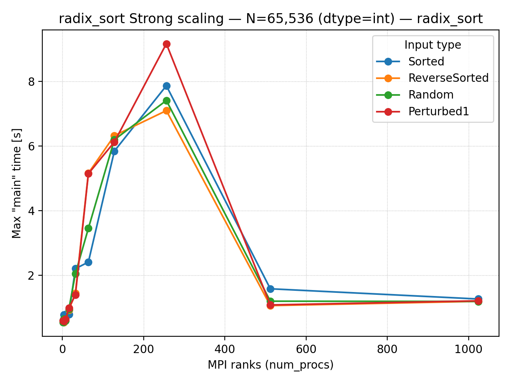
  <figcaption>$Figure 2.1: Radix Sort$ Strong Scaling — (N=65,536)</figcaption>
</figure>

  In Figure 2.1 the maximum time of "main" as a function of the number of processes for an input size of 2^16 (65,536). It can be observed that the time for main to complete increases sharply until 256 processes. This is because the extra time needed for the processes to communicate, synchronize, and redistribute array elemtents is less efficient than a smaller number of processes taking on more computation. For 512 and 1024 processes, the decreased computation time for each process proves to be more signifcant than the comunication overhead. The 1% Perturbed input shows the largest peak due to additional load imbalance during redistribution.


<figure style="text-align:center;">
  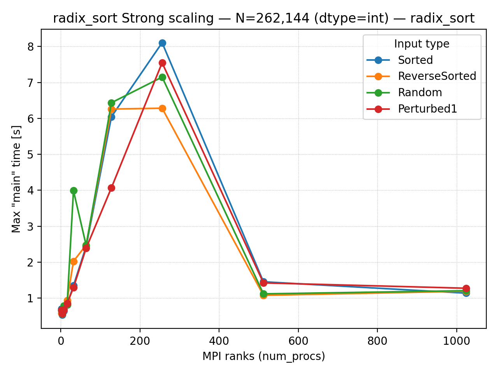
  <figcaption>$Figure 2.2: Radix Sort$ Strong Scaling — (N=262,144)</figcaption>
</figure>

  In Figure 2.2, a similar trend to that of Figure 2.1 is observed, with a large spike in the completion time of "main" before ultimately, the reduced computation time outweighs the cost of inter-process communications. With an input size of 2^18 (262,144), the randomly sorted array shows a significant spike around 32 processes. This is likely due to the nature of the randomly distributed data, which can cause temporary load imbalance across ranks during redistribution. At this scale, communication and synchronization costs become significant as the number of all-to-all exchanges increases, leading to higher overall runtime. As the workload per process continues to shrink, radix sort becomes more efficient, leading to lower runtimes for "main."

<figure style="text-align:center;">
  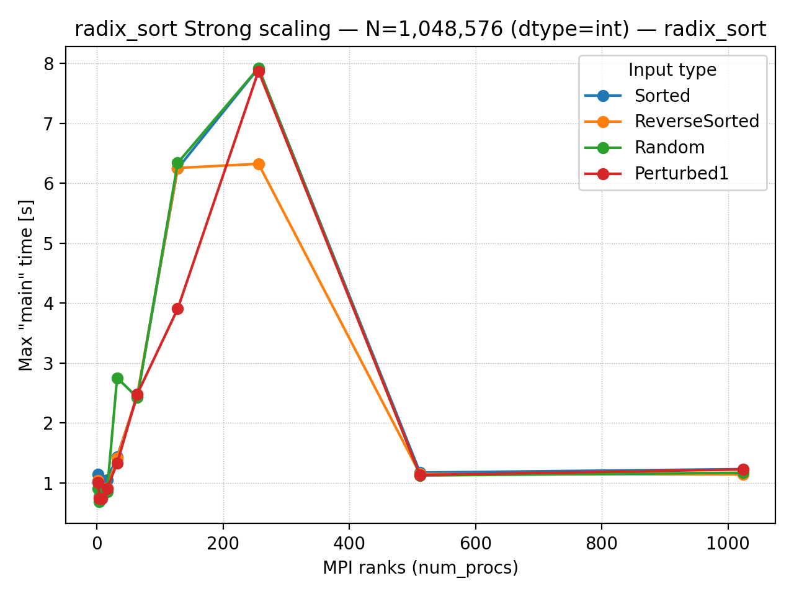
  <figcaption>$Figure 2.3: Radix Sort$ Strong Scaling — (N=1,048,576)</figcaption>
</figure>

  With an input size of 2^20 (1,048,576), a similar trend to the previous graphs is observed with Figure 2.3. With 2, 4, and 8, and 16 processes, Radix Sort finishes quickly, as there is little overall communication between processes and the computations are split well between the processes. Beyond 16 processes, we once again observe increased runtimes, as communication between a large number of processes is simply inefficient with this size of our array.

<figure style="text-align:center;">
  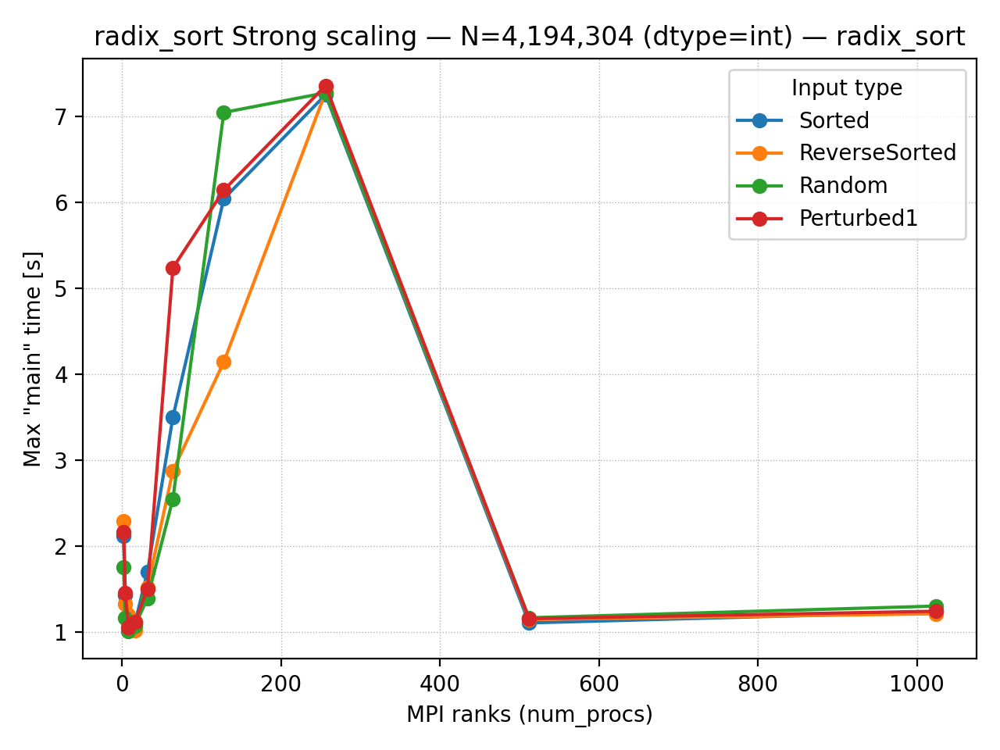
  <figcaption>$Figure 2.4: Radix Sort$ Strong Scaling — (N=4,194,304)</figcaption>
</figure>

  In Figure 2.4, we begin to see the inefficieny of using too little processes. Using only 2 or 4 processes becomes less efficient compared to 8 or 16 processes. This is because the size of the array is now too big for such a small number of processes, leading to a large number of computations needing to be distributed between them. However, for this input size, 8 and 16 processes seems to be the sweet spot, as after 16 processes we start to see the runtime increasing, since the communication cost outweighs the time saved by smaller computation per process.

<figure style="text-align:center;">
  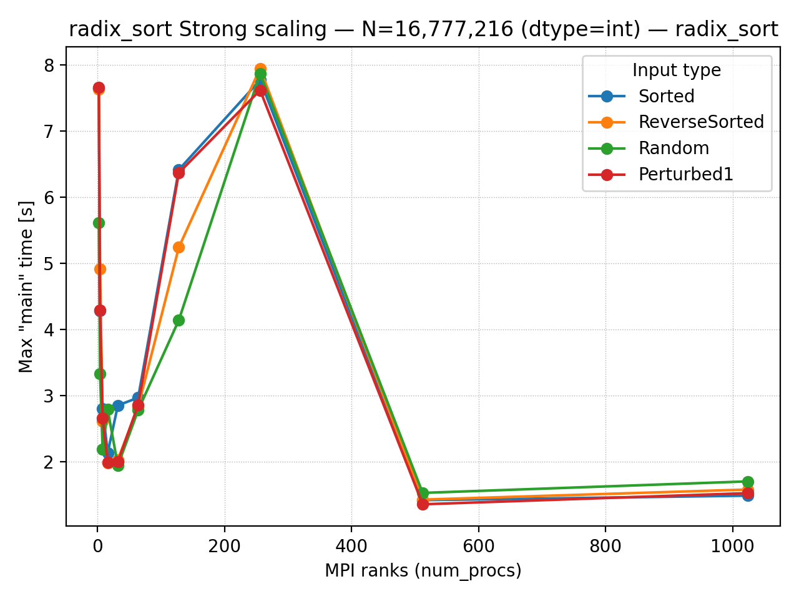
  <figcaption>$Figure 2.5: Radix Sort$ Strong Scaling — (N=16,777,216)</figcaption>
</figure>

  Figure 2.5 makes the trend observed in Figure 2.4 even more prominent, as an input size of 2^24 (16,777,216) is too large for 2 , 4, 8, 16, and 32 processes. In fact, using omly 2 processes is as inefficient as 256 procsses, despite the large communication overhead. Once again after 256 procsses, we see low runtimes, as the processes have relatively few calculations to perform. Something that can be observed with all the Figures is that all input types (Sorted, 1% Perturbed, Random, and Reverse sorted) are tightly grouped for 512 and 1024 processes. This is because with such a large number of processes, the number of computations is so little that it does not matter the structure of the input.

<figure style="text-align:center;">
  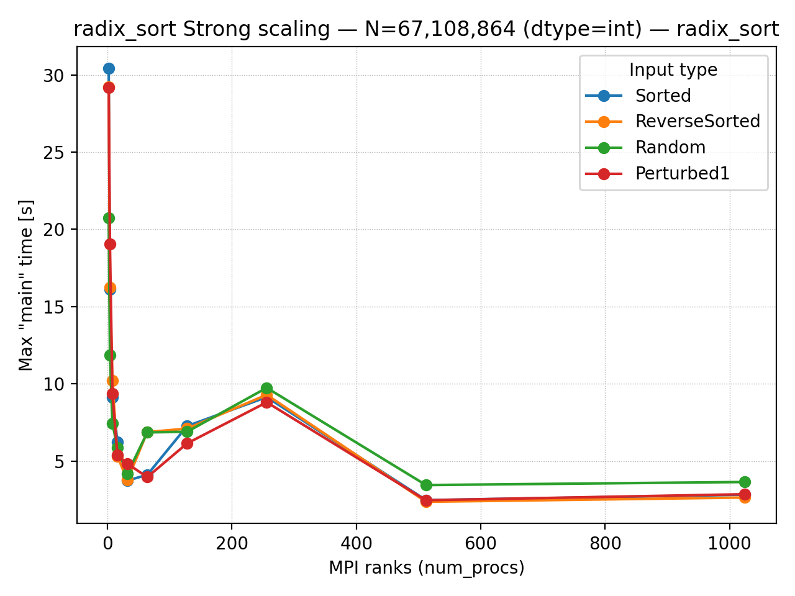
  <figcaption>$Figure 2.6: Radix Sort$ Strong Scaling — (N=67,108,864)</figcaption>
</figure

  In Figure 2.6, we see an almost perfect exponential decrease in the runtime of "main" as the number of processes increases. For an input size of 2^26 (67,108,864), The lower number of processes are severly hindered, taking as long as roughly 30 seconds to complete all necessary computations. 256 processes still takes around 8 seconds (similar to the other graphs), however, the increased overhead in communication time is still far more efficient than leaving all the computation to just 2 or 4 proc


<figure style="text-align:center;">
  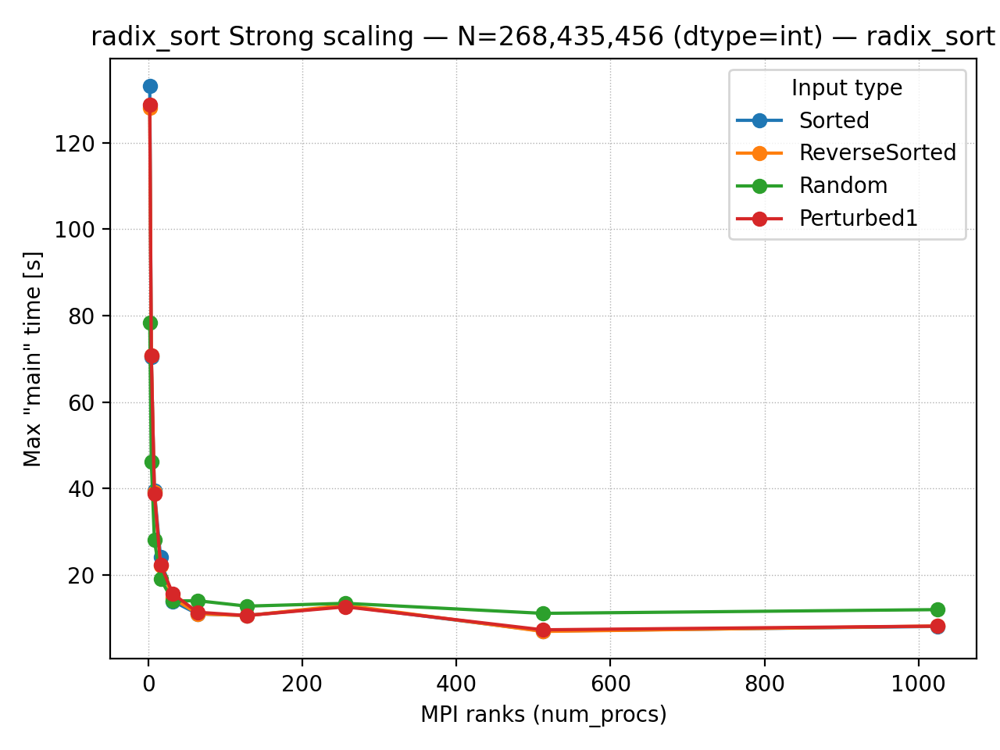
  <figcaption>Figure 2.7: Radix Sort Strong Scaling — (N=268,435,456)</figcaption>
</figure>

  Finally, with an input size of 2^28 (268,435,456), Radix Sort is almost entirely more efficient as the number of processes increases. While 256 processes still incurs some communication overhead penalty, it takes nearly the same amountof time as 128 and 64 processes. Anything less than 64 processes takes an increeasingly longer time to fully complete, with 2 processes taking over two minutes. We also see that there is little different between using 512 processes and 2024 processes, which is consistent with the results for Radix Sort observed in Figure 1.3. Radix Sort's speedup begins to plateau as the more efficient computation time and the less effecient communication time begin to balance out.


#### Sample Sort Analysis:
<figure style="text-align:center;">
  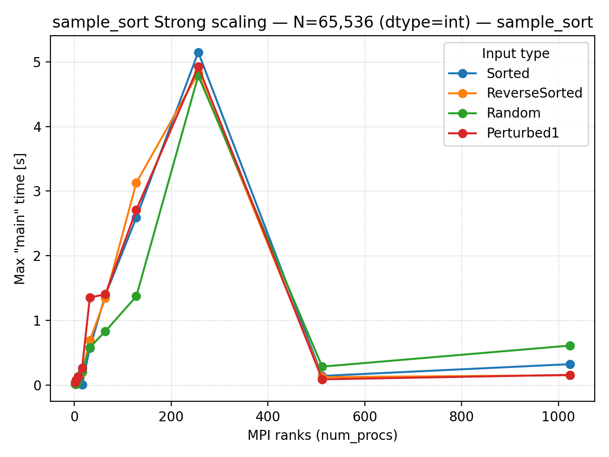
  <figcaption>Figure 2.8 Sample Sort Strong Scaling — (N=65,536)</figcaption>
</figure>

<figure style="text-align:center;">
  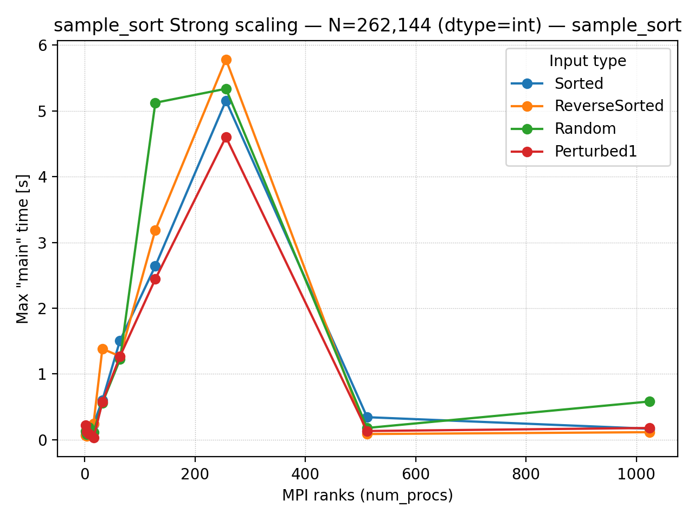
  <figcaption>Figure 2.9 Sample Sort Strong Scaling — (N=262,144)</figcaption>
</figure>

<figure style="text-align:center;">
  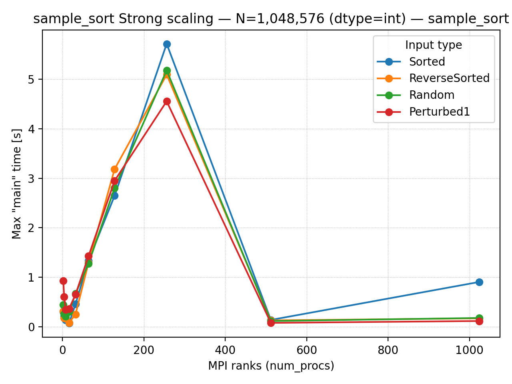
  <figcaption>Figure 2.10 Sample Sort Strong Scaling — (N=1,048,576)</figcaption>
</figure>

<figure style="text-align:center;">
  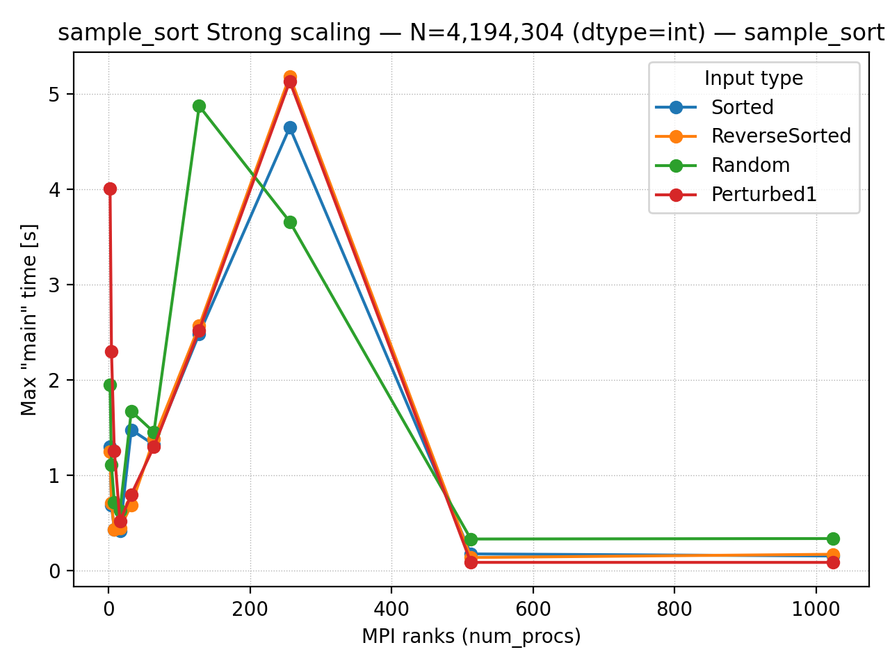
  <figcaption>Figure 2.11 Sample Sort Strong Scaling — (N=4,194,304)</figcaption>
</figure>

<figure style="text-align:center;">
  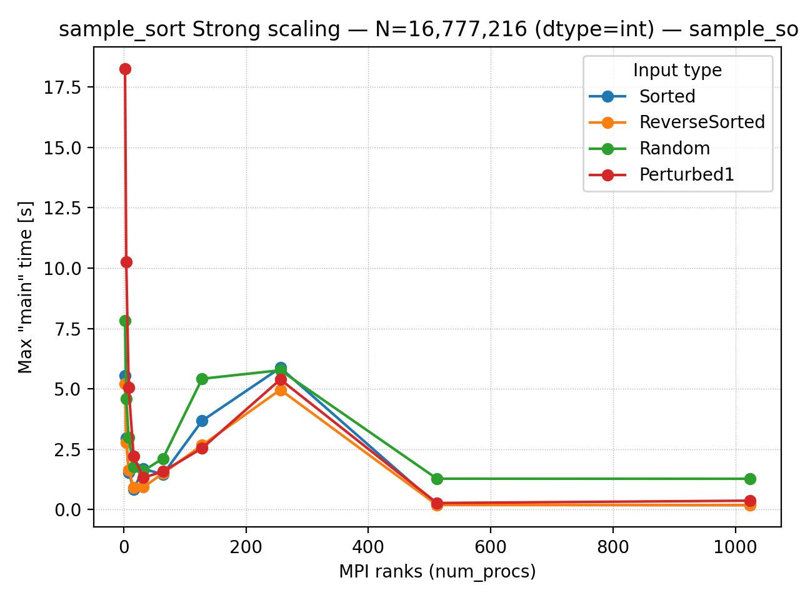
  <figcaption>Figure 2.12 Sample Sort Strong Scaling — (N=16,777,216)</figcaption>
</figure>

<figure style="text-align:center;">
  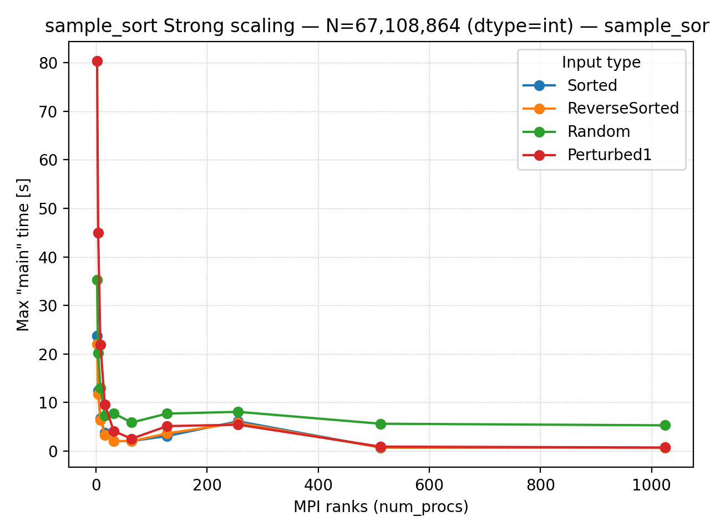
  <figcaption>Figure 2.13 Sample Sort Strong Scaling — (N=67,108,864)</figcaption>
</figure>

<figure style="text-align:center;">
  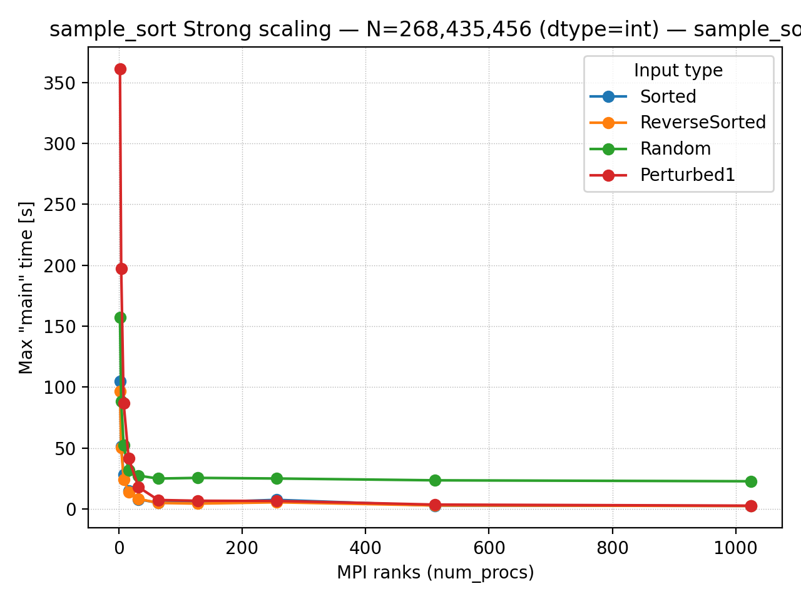
  <figcaption>Figure 2.14 Sample Sort Strong Scaling — (N=268,435,456)</figcaption>
</figure>

Across sizes, Sample Sort shows good strong scaling until communication dominates. For small N (65K–262K), curves are latency-bound and even rise around 128–256 ranks, then drop sharply at 512 ranks (likely a runtime/topology or MPI-collective switch) before settling on a small floor. For medium N (1M–4M), time falls roughly with 1/p up to ~128–256 ranks and then flattens at a communication floor (Allreduce/Alltoallv + memory bandwidth). For large N (16.8M–268M), compute still benefits up to ~128–256 ranks, but beyond that the curves are nearly flat, indicating bandwidth-dominated shuffles. Input type only mildly affects time at scale(“Random” is often a bit higher on the floor) while occasional small-p spikes for “Perturbed1” are consistent with sampling/partition imbalance rather than steady-state cost.

Sample Sort’s compute speedup tracks the ideal line and sometimes rises above it--super-linear scaling that occurs when each rank’s working set N/p fits deeper in cache and/or uses more memory channels/sockets, lowering per-element cost; a slightly inflated T at 2 (processes) baseline (NUMA/cold caches) can accentuate this effect. In contrast, communication speedup stays ~1 with dips around 128–256 ranks, so Allreduce/Alltoallv dominates at scale. Consequently the end-to-end speedup is sub-linear and flattens at high p's, with random inputs lowest (most uniform, heaviest all-to-all) and 1%-perturbed typically best.

In the updated weak scaling plots, Sample Sort shows clear evidence of good scalability up to mid-range process counts but with rising per-rank cost at higher scales. The average time per rank remains steady up to about 64–128 processes, confirming that local sorting remains well-balanced and compute overhead scales with per-process data. Beyond this range, Sample Sort’s runtime increases noticeably, indicating growing communication overhead and synchronization delays during global partitioning and redistribution. Despite this, Sample Sort remains competitive overall, demonstrating efficient weak scaling behavior across input types, with only moderate performance loss at the largest scales.

## Merge Sort Analysis:

<figure style="text-align:center;">
  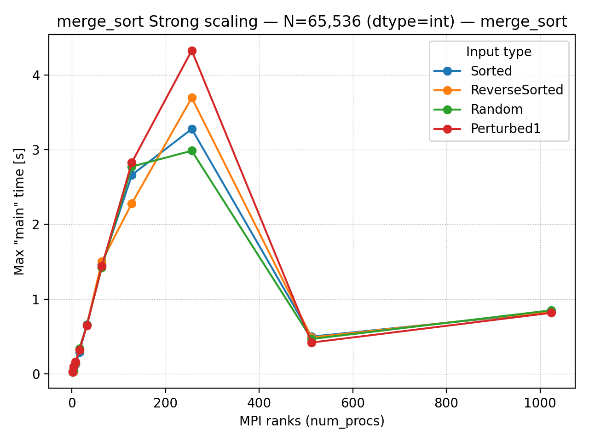
  <figcaption>Figure 2.15: Merge Sort Strong Scaling — (N=65,536)</figcaption>
</figure>

In Figure 2.15, the maximum “main” time as a function of process count shows an early rise before tapering off beyond 256 processes. At this small problem size (2¹⁶ elements), the communication and synchronization overhead dominate, causing the runtime to increase sharply as more ranks are introduced. Each process spends more time exchanging boundary data than performing useful local sorting work. Once the computation per process becomes extremely small, around 512 and 1024 processes, the runtime levels off as both communication and computation become minimal. The modest differences among input types suggest that at this scale, the cost is dominated by MPI communication rather than data ordering.


<figure style="text-align:center;">
  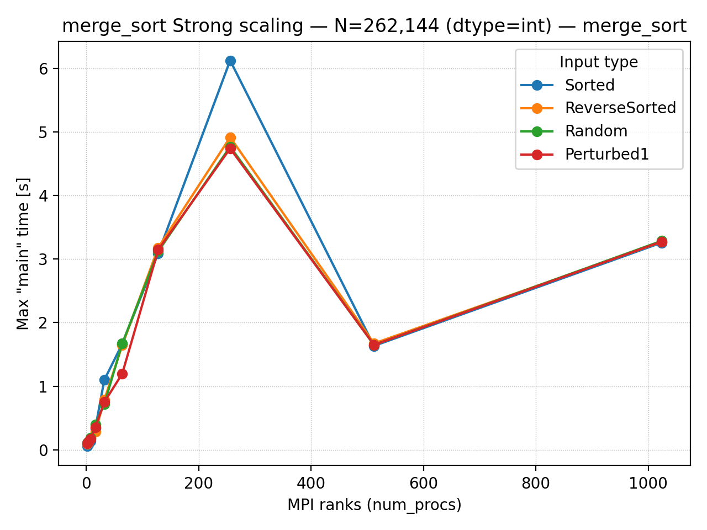
  <figcaption>Figure 2.16: Merge Sort Strong Scaling — (N=262,144)</figcaption>
</figure>

Figure 2.16 exhibits a similar pattern to that seen at N = 65,536, though the larger input size results in slightly better scalability. The time for “main” rises until roughly 256 processes, reflecting a point where inter-process data redistribution becomes inefficient relative to computation. Beyond this point, the runtime decreases modestly, indicating improved parallel efficiency once each process has enough data to sort locally. The curves for all input types closely overlap, suggesting that merge sort maintains stable performance regardless of initial data arrangement, with communication overhead again being the primary scaling limiter.


<figure style="text-align:center;">
  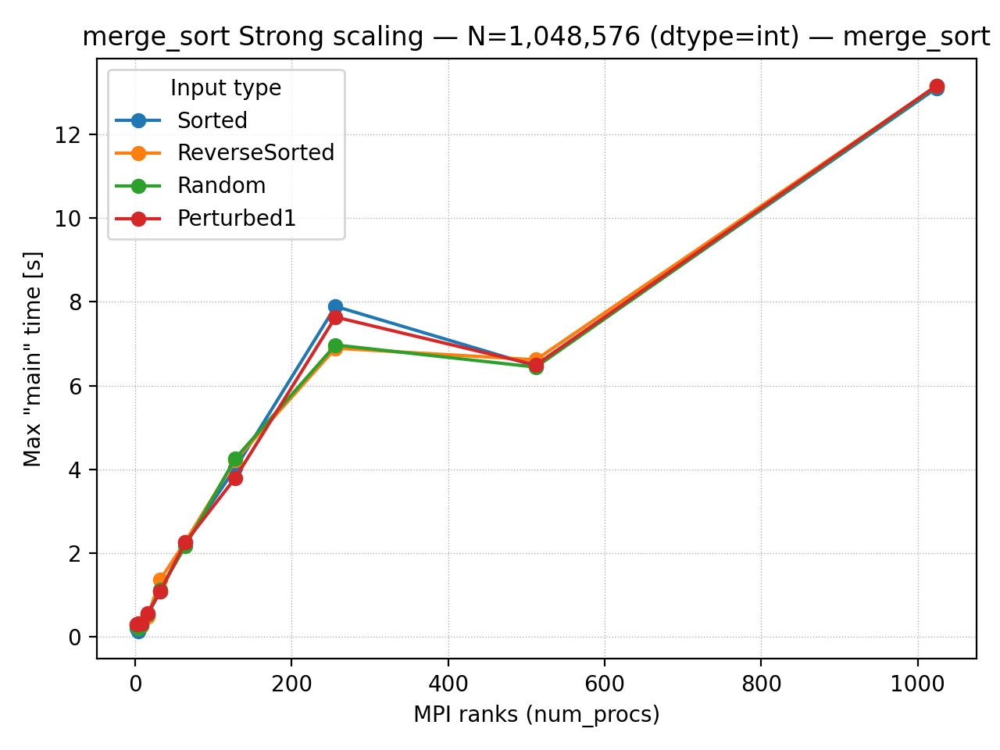
  <figcaption>Figure 2.17 Merge Sort Strong Scaling — (N=1,048,576)</figcaption>
</figure>

In Figure 2.17, the merge sort runtime increases smoothly up to 256 processes before tapering off, showing that at one million elements (2²⁰), the algorithm begins to approach strong-scaling efficiency. At this size, computation time per process becomes significant enough to offset communication costs, leading to a more balanced performance profile. The smaller rise between 512 and 1024 processes indicates that merge sort maintains relatively good load distribution, though synchronization during merging still prevents perfect linear speedup.


<figure style="text-align:center;">
  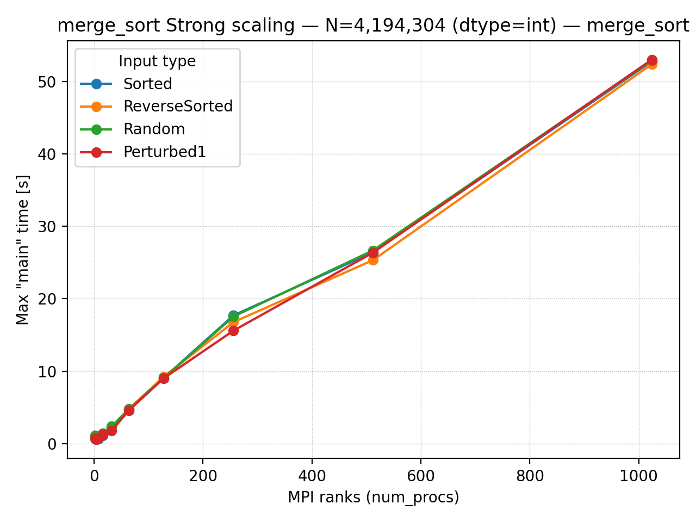
  <figcaption>Figure 2.18 Merge Sort Strong Scaling — (N=4,194,304)</figcaption>
</figure>

Figure 2.18 demonstrates nearly linear scaling behavior across all process counts. As the dataset grows to over four million elements, the computational workload per process dominates the total runtime, and the relative cost of communication diminishes. The strong linear trend across all input types indicates that merge sort is able to efficiently utilize available processes without significant imbalance. The slight curvature at the highest ranks likely reflects the increasing cost of inter-process merging, which becomes more pronounced as the number of communication partners grows.


<figure style="text-align:center;">
  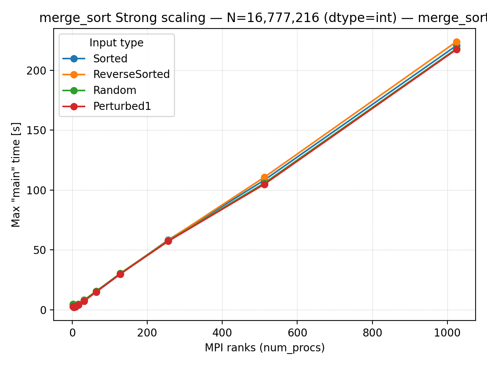
  <figcaption>Figure 2.19 Merge Sort Strong Scaling — (N=16,777,216)</figcaption>
</figure>

At this input size, merge sort achieves excellent scalability, as shown in Figure 2.19. Runtime increases proportionally with the number of processes, indicating efficient parallel workload distribution. Communication and computation remain well balanced, and the close alignment of all input types confirms that initial data ordering has minimal impact on performance. The smooth scaling curve suggests that the algorithm efficiently overlaps computation with communication, maintaining good performance even at 1024 processes.


<figure style="text-align:center;">
  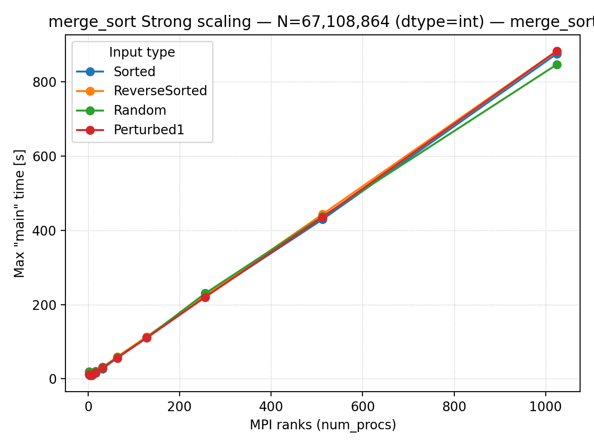
  <figcaption>Figure 2.20 Merge Sort Strong Scaling — (N=67,108,864)</figcaption>
</figure>

In Figure 2.20, the strong-scaling curve remains almost perfectly linear across the full range of process counts. The runtime growth corresponds directly to the fixed global workload being divided among increasingly many ranks. The slope of the line indicates consistent per-process efficiency, implying that both the local sort and the merging stages scale effectively at this size. The lack of divergence among input types reinforces that merge sort’s communication pattern and workload balance are largely insensitive to data ordering when operating at high data volumes.


<figure style="text-align:center;">
  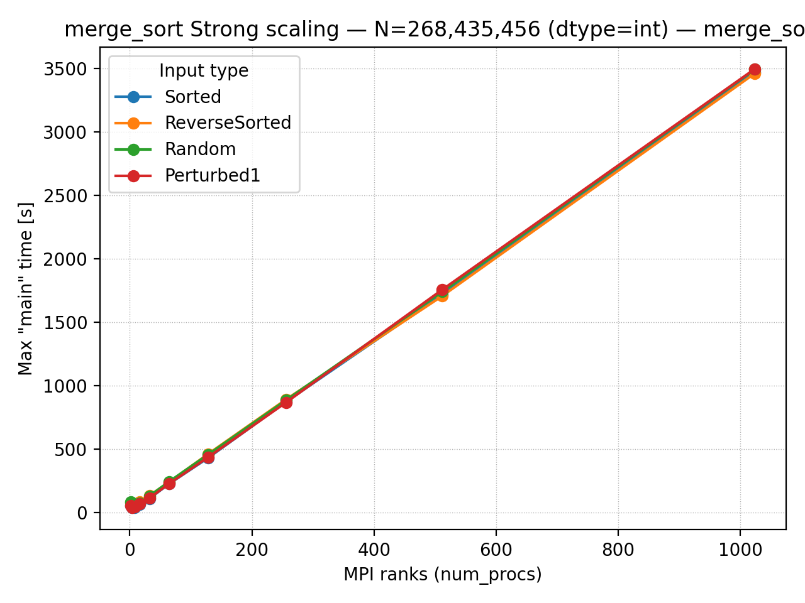
  <figcaption>Figure 2.21 Merge Sort Strong Scaling — (N=268,435,456)</figcaption>
</figure>

Figure 2.21 shows merge sort operating on a very large dataset of 268 million elements, where the strong-scaling curve continues to exhibit linear growth. Runtime increases proportionally with the number of processes, demonstrating excellent scalability at extreme problem sizes. This result confirms that merge sort’s computation phase dominates the total runtime, with communication overhead representing only a small fraction of total cost. The consistent performance across all input types further indicates that the algorithm remains well balanced and communication-efficient, even when scaled to over a thousand processes.

#### Strong Scaling Comparison
From Figures 2.1 - 2.21 we see that all algorthims display good strong scaling with lower input sizes. After overcoming the communication overhead (which was overcome by all three algorthims at 512 processes), the algorthims achieved faster runtimes as a result of the parallelization of each algorithm. Our data also shows that the need for parallelization is largely dependent on the size of our input. With lower input sizes, the sorting algorithms don't need to be overly parallelized, as they were more efficient with 2/4 processors than they were with 512/1024 processors. With larger input sizes, the need for parallelization increases. Overlooking the issue regarding the sequential merging of elements at rank 0 for merge sort, both sample sort and radix sort scaled very well when looking at large input sizes. Computation cost becomes too much for only a few processes to handle, creating a need for parallelization. At the large input sizes, it appears Radix sort generally performed the best across all process counts, achieving the lowest runtimes compared to merge and sample sort. That said, sample sort did trail close behind, achieving similar results.


### Weak Scaling:

<figure style="text-align:center;">
  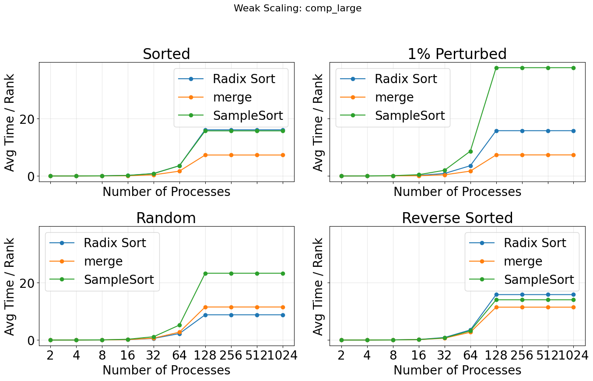
  <figcaption>Figure 3.1: Comp Large Weak Scaling Plot</figcaption>
</figure>

Radix - For large computation, we see that an ideal behavior is observed for the first few processes, as the increase in processes scales well with the input size. We then see at round 64 processes, this trend breaks, as the input size outscales the number of processes. This eventually plateaus. It should be noted that because there were 10 different process counts and 7 different input_sizes, the last 3 process copunts all use an input size of 2^28.

Merge - From Figure 3.1, it can be seen that Merge Sort maintains relatively stable performance as the number of processes increases. Across all input types (Sorted, 1% Perturbed, Random, and Reverse Sorted), the average time per rank remains nearly constant, with only a small rise beyond 64 processes. This behavior demonstrates good weak scaling efficiency in the computation-heavy portion of the algorithm. Because each process handles a proportionally larger workload as the total input size grows, Merge Sort’s local sorting phase dominates execution time, allowing the algorithm to efficiently utilize additional processes without major degradation in performance. The minimal variation between input types further suggests that computation time in this region is largely unaffected by data ordering.

Sample - From Figure 3.1, Sample Sort demonstrates efficient scaling up to about 32–64 processes, after which the average time per rank rises sharply before plateauing. This trend indicates that while computation scales well initially, communication and synchronization overheads (particularly from global sampling and all-to-all bucket redistribution) begin to dominate at higher process counts. The 1% Perturbed and Random inputs show the steepest increases, suggesting greater communication imbalance when data is not perfectly uniform. Beyond 128 processes, the timing stabilizes, implying that each rank maintains a relatively consistent workload even as total data and process count grow. Overall, Sample Sort achieves strong computation efficiency in this region but its weak scaling is ultimately limited by collective communication costs that scale superlinearly with process count.


<figure style="text-align:center;">
  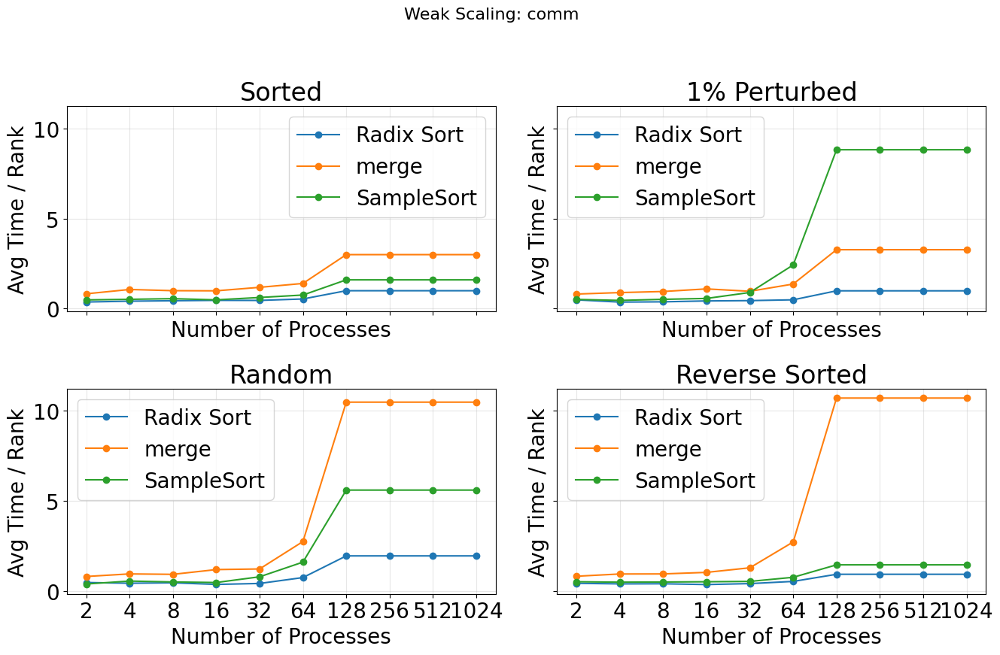
  <figcaption>Figure 3.2: Comm Weak Scaling Plot</figcaption>
</figure>

Radix - From our strong scaling analysis and our strong sccaling speedup, we know tha communication is Radix Sorts' Weakness, however with weak scaling, we don't observe any significant communicaiton bottlenecks, with the time of communication increasing only slightly as the number of processes and input size increases. This suggests that its communication overhead scales efficiently with system size, even though it was more pronounced in the strong scaling case.

Merge - In Figure 3.2, the average communication time per rank for Merge Sort remains relatively low for smaller process counts but increases slightly as the number of processes grows beyond 64. This increase reflects the added communication overhead required during the redistribution and merging phases of the algorithm. As more processes participate, the amount of data exchanged and synchronized rises, leading to minor increases in average time per rank. However, the growth remains moderate, indicating that Merge Sort maintains acceptable communication efficiency under weak scaling conditions. The results suggest that while Merge Sort’s communication phase does not scale perfectly, it remains manageable and does not dominate the total runtime.

Sample - From Figure 3.2, the weak scaling communication performance for Sample Sort shows stable behavior up to around 32–64 processes, after which the average time per rank increases sharply and then plateaus. This trend reflects the growing cost of collective operations such as Alltoallv and Allreduce used during splitter sampling and bucket redistribution. The spike beyond 64 processes indicates that communication overheads (particularly from bucket imbalance and synchronization) become dominant as more processes participate. The 1% Perturbed and Random inputs exhibit the largest increases, consistent with non-uniform bucket distributions that require additional data movement. Overall, Sample Sort’s communication scales efficiently at small to medium process counts, but its global data exchange phase limits scalability at higher ones.

<figure style="text-align:center;">
  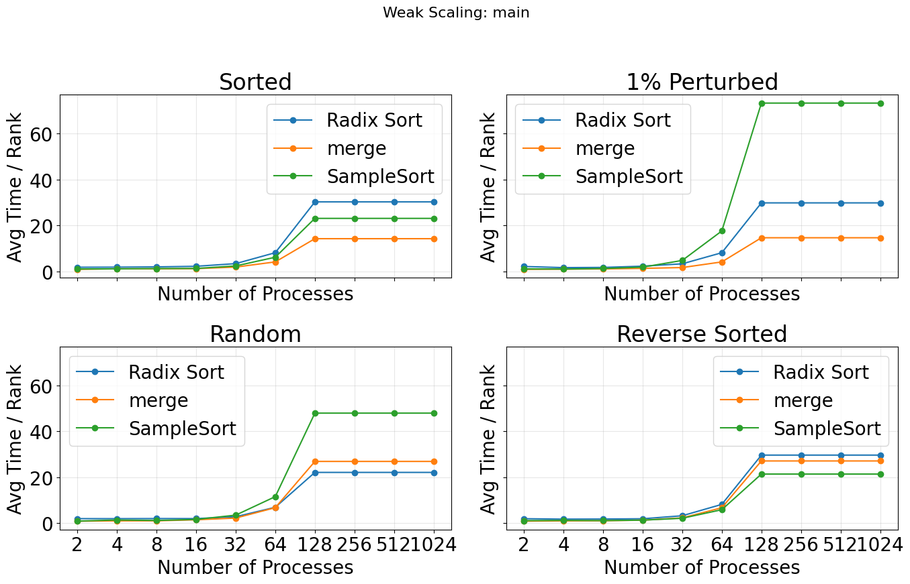
  <figcaption>Figure 3.3: Main Weak Scaling Plot</figcaption>
</figure>

Radix - Main incurs a greater penalty when looking at weak scaling, as the time for completion increases signifcantly as the number of processes and input size increase, reaching over 60 seconds. This suggests that while Radix Sort maintains good communication efficiency, its total runtime is increasingly dominated by computation and synchronization overheads as the global problem size grows.

Merge - From Figure 3.3, Merge Sort demonstrates strong weak scaling characteristics overall, with the average time per rank remaining nearly constant across increasing process counts for all input types. A small upward trend appears at higher process counts, particularly beyond 64 processes, due to the cumulative effects of communication and synchronization overheads. Nonetheless, the overall stability of the curves shows that Merge Sort efficiently balances computational and communication workloads as problem size scales with the number of ranks. The consistent behavior across input types indicates that data ordering has minimal effect on scaling efficiency, and that the algorithm effectively maintains performance under growing parallel workloads.

Sample - From Figure 3.3, Sample Sort’s weak scaling for the main runtime shows stable performance up to around 32–64 processes before rising sharply and then plateauing. This increase reflects the combined effects of communication and computation overhead as both the number of processes and total input size grow. The 1% Perturbed and Random inputs experience the steepest increases, suggesting that imperfect load balancing and bucket redistribution contribute significantly to total runtime. After the initial jump, performance levels off, indicating that each rank’s workload stabilizes despite higher global scale. Overall, Sample Sort maintains good efficiency for moderate scales but faces limitations at larger process counts due to cumulative synchronization and all-to-all data exchange costs.

#### Weak Scaling Comparison

Comparing the three algorithms, all seem show good weak scaling until around 64 processes with an input size of 2^26. We also see than different input types causes varying results for the performance of the different algorithms. For main and large computation, 1% Perturbed and Random data seem to add more strain to Sample Sort compared to Radix and Merge Sort, likely due to imbalanced bucket distributions that lead to uneven workloads and increased all-to-all communication during the splitter sampling and bucket exchange phases. On the otherhand, for communication weak scaling, 1% Perturbed data and Random data puts more strain on merge sort. This is because Merge Sort requires multiple rounds of data redistribution and merging, and when data is randomly distributed or slightly perturbed, the communication pattern becomes irregular, causing higher all-to-all exchange overhead and synchronization delays across ranks. Radix Sort appears to operate between the two other algorithms, though notably Radix Sort takes more time for Sorted and Reverse Sorted than the other two algorithms (when looking at Main). This is likely a because Radix Sort is indifferent to whether the input is already sorted or not. Radix Sort has a fixed amount of "work" per pass: building histograms, prefix sums, compute destinations, and rearrange elements. This means that even when sorted, Radix Sort repeatedly moves data, unlike Sample and Merge Sort. 
